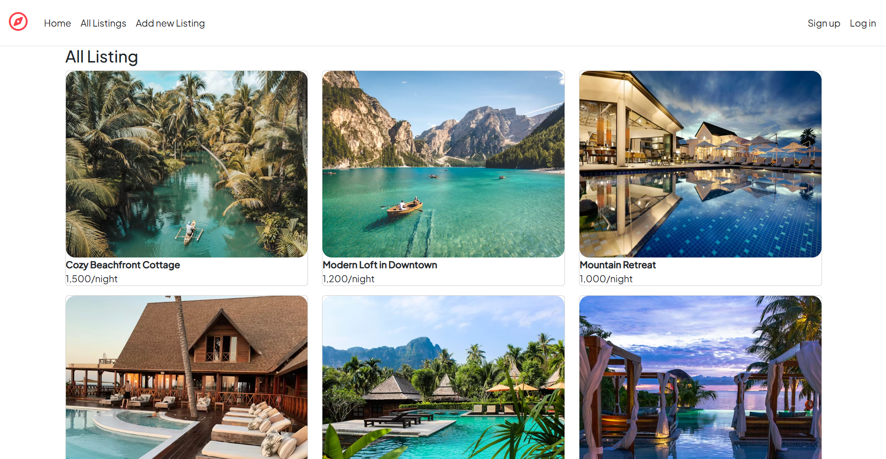
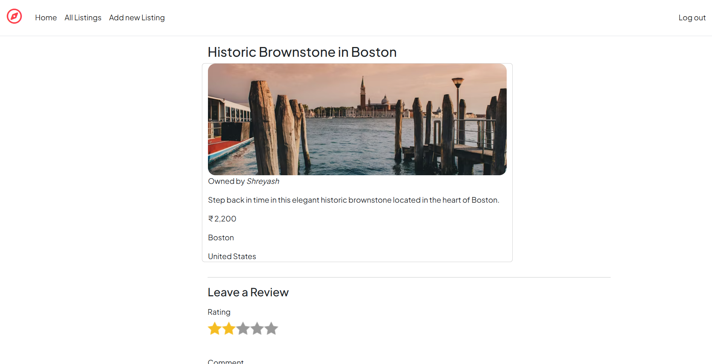
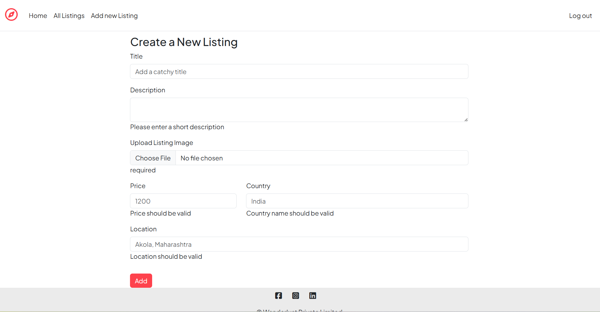

# Wanderlust – Travel Accommodation Web Application

Wanderlust is a full-stack web application inspired by Airbnb, allowing users to explore, list, and review travel accommodations.

## 🚀 Features

- User Authentication (Login / Signup)
- Create, Update, Delete listings
- Add reviews and ratings
- RESTful APIs
- Responsive UI

## 🛠️ Tech Stack

- Backend: Node.js, Express.js
- Database: MongoDB
- Frontend: HTML, CSS, JavaScript
- Tools: Git, GitHub

## 📂 Screenshots

## ⚙️ How to Run Project

1. Install dependencies  
   npm install

2. Start server  
   node app.js

3. Open browser  
   http://localhost:8000

## 👤 Author

Shreyash Manatkar  
GitHub: https://github.com/ShreyashManatkar
